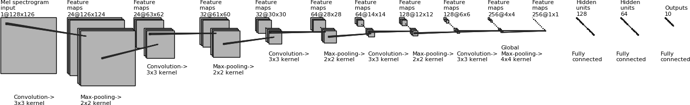

# cnn-audio-classification
Audio classification with PyTorch using a convolutional neural network trained on the UrbanSound8K data set.

For more details about the UrbanSound8K dataset see https://urbansounddataset.weebly.com/urbansound8k.html

## Feature Extraction

Use feature_extract.py first to extract features from the downloaded UrbanSound8K.

This script takes the original UrbanSound8K dataset and extracts features from the audio in the form of Mel spectrograms. The path to the dataset location can be defined by the user using the -d flag.

The sample-rates of the audio files are first converted to 16 kHz before Mel spectrograms are calculated.

The extracted features are saved in the current directory to the file 'features.pt' as a list of Pytorch tensors along with their associated audio class numbers and data fold numbers.

usage: python feature_extract.py -d <path_to_dataset>

## Model Training

Use train.py to train models using the features extracted from the UrbanSound8K dataset.

This script takes extracted features from the UrbanSound8K dataset and trains a convolutional neural network for audio classification.

The script requires the extracted features to be found in the file 'features.pt' as a list of Pytorch tensors along with their associated audio class numbers and data fold numbers. This file should first be generated using the associated script 'feature_extract.py'

The user can define the fold number (1-10) that is used for validation using the -f flag. The best model according to its accuracy when applied to the validation fold is saved in the folder 'models' within the current directory. A log file is also generated in the folder 'logs' within the current directory. The log file logs the model's performance at each epoch.

usage: python train.py -f <validation fold number (1-10)>

## Classify Wav File

Use infer_wav.py to classify a single .wav file according to the categories defined in the UrbanSound8K dataset.

This script uses a trained model to classify a single wav file according to the categories defined by the UrbanSound8K dataset. Currently the model used defaults to the model trained using folds 1-9 of the dataset. This is the default model that is trained and saved if the associated training script 'train.py' script is run successfully. Note that before this script can be run, the feature extraction script 'feature_extract' and the training script 'train.py' must first be run to train the model.

usage: python infer_wav.py -f <wav_file_name>

## Model Architecture

## Results

Highest measured accuracy on folds 1-10 over 200 epochs, when the other 9 folds are used for training:

| Fold   |      Accuracy      |
|----------|:-------------:|
|1|74.7%|
|2|74.5%|
|3|72.8%|
|4|78.7%|
|5|80.2%|
|6|81.2%|
|7|72.4%|
|8|73.3%|
|9|85.1%|
|10|85.1%|

Average Accuracy: 77.8%
Standard Deviation: 4.7%

## Requirements

A CUDA enabled PyTorch installation.

torchaudio, pandas, tqdm
